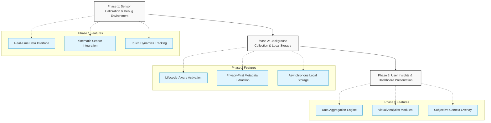

# Feature Roadmap: Keystroke Dynamics Integration

This roadmap outlines the strategic phases for integrating passive behavioral tracking and sensor analytics into the custom keyboard project. The focus is on securely capturing device interactions and transforming them into meaningful, actionable insights for the user.

## Visual Roadmap Overview

---

## Phase 1: Sensor Calibration and Debug Environment
**Objective:** Establish a controlled, isolated testing environment within the companion application to verify that all device sensors are capturing data accurately and at the appropriate frequencies before deploying to the live keyboard.

*   **Real-Time Data Interface:** 
    *   Develop a dedicated diagnostic screen where developers and testers can input text and observe live sensor metrics.
*   **Kinematic Sensor Integration:** 
    *   Connect the device’s internal gyroscope and accelerometer. 
    *   Visualize the X, Y, and Z axes in real-time to observe the physical force and device posture changes during typing.
*   **Touch Dynamics Tracking:** 
    *   Implement logic to precisely measure micro-interactions.
    *   Calculate **Dwell Time** (duration a key is depressed) and **Flight Time** (the transition speed between keys).
*   **Data Validation Export:** 
    *   Provide an option to export short diagnostic sessions to a raw text or spreadsheet format to verify data structure and timing accuracy.

---

## Phase 2: Unobtrusive Background Collection & Secure Local Storage
**Objective:** Seamlessly transition the sensor tracking into the live keyboard environment, ensuring data is collected passively without draining the device battery, causing input lag, or compromising user privacy.

*   **Lifecycle-Aware Activation:** 
    *   Configure the sensors to wake up strictly when the keyboard is summoned on-screen and to power down immediately when the keyboard is hidden.
*   **Privacy-First Metadata Extraction:** 
    *   Hook into the keystroke events to capture timing and physical interaction metrics.
    *   Enforce strict privacy filters: log event types (e.g., "Alphanumeric", "Backspace", "Space") and timestamps while permanently discarding the actual linguistic characters inputted.
*   **Asynchronous Local Storage:** 
    *   Establish a secure, on-device local database to store the collected sensor events.
    *   Ensure data processing and saving occur in the background, keeping the user's typing experience fluid and uninterrupted.

---

## Phase 3: User Insights and Dashboard Presentation
**Objective:** Utilize the companion application to translate vast amounts of raw behavioral and kinematic data into digestible, visual insights that empower the user to understand their digital habits and cognitive states.

*   **Data Aggregation Engine:** 
    *   Create internal processes to summarize the raw data points into daily and weekly averages (e.g., average words per minute, daily backspace frequency, average dwell times).
*   **Visual Analytics Modules:**
    *   **Typing Rhythm Trends:** A visual graph displaying typing speed and fluidity over time, helping to establish a user baseline and highlight deviations.
    *   **Cognitive Fatigue Heatmap:** Visual representations of error rates and auto-correct reliance to indicate potential moments of low focus or fatigue.
    *   **Circadian Usage Patterns:** Time-of-day visualizations that map when typing sessions occur, specifically flagging late-night usage that may indicate sleep disruption.
*   **Subjective Context Overlay (Optional):** 
    *   Implement a simple daily check-in allowing users to log their mood or energy levels.
    *   Overlay this subjective self-reporting onto the objective sensor graphs to help users identify personal behavioral patterns.