# Feature Roadmap: Keystroke Dynamics Integration

This roadmap outlines the strategic phases for integrating passive behavioral tracking and sensor analytics into the custom keyboard project. The focus is on securely capturing device interactions and transforming them into meaningful, actionable insights for the user.

## Visual Roadmap Overview

```mermaid
flowchart TD
    classDef phase fill:#f9f9f9,stroke:#333,stroke-width:2px;
    classDef feature fill:#e1f5fe,stroke:#0288d1,stroke-width:1px;

    P1[Phase 1: Sensor Calibration & Debug Environment]:::phase
    P1_1[Phase 1.1: Live Keyboard Data & Metric Alignment]:::phase
    P2[Phase 2: Background Collection & Local Storage]:::phase
    P3[Phase 3: User Insights & Dashboard Presentation]:::phase
    P4[Phase 4: Session Detail Refresh]:::phase
    P5[Phase 5: Session Dashboard]:::phase
    P6[Phase 6: Diagnostics Screen Improvements]:::phase
    P7[Phase 7: Emoji & Autocorrect Capture]:::phase
    P8[Phase 8: Mood Bar & Contextual Overlay]:::phase
    P9[Phase 9: Global Insights Expansion]:::phase
    P10[Phase 10: Rebranding & New Identity]:::phase
    P11[Phase 11: Usage Map & Daily Activity Charts]:::phase

    P1 --> P1_1
    P1_1 --> P2
    P2 --> P3
    P3 --> P4
    P4 --> P5
    P5 --> P6
    P6 --> P7
    P7 --> P8
    P8 --> P9
    P9 --> P10
    P10 --> P11

    subgraph Phase 1 Features
        F1[Real-Time Data Interface]:::feature
        F2[Kinematic Sensor Integration]:::feature
        F3[Touch Dynamics Tracking]:::feature
    end

    subgraph Phase 1.1 Features
        F1_1[Live Keyboard Capture]:::feature
        F1_2[Metric Realignment]:::feature
    end

    subgraph Phase 2 Features
        F4[Lifecycle-Aware Activation]:::feature
        F5[Privacy-First Metadata Extraction]:::feature
        F6[Asynchronous Local Storage]:::feature
    end

    subgraph Phase 3 Features
        F7[Data Aggregation Engine]:::feature
        F8[Visual Analytics Modules]:::feature
        F9[Subjective Context Overlay]:::feature
    end

    subgraph Phase 4 Features
        F10[Session Metadata Header]:::feature
        F11[Magnitude-First Sensor Display]:::feature
    end

    subgraph Phase 5 Features
        F12[Per-Session KPI + Metadata Strip]:::feature
        F13[IKD / Gyro / Accel Time-Series Charts]:::feature
        F14[Raw Lists Replaced by Charts]:::feature
    end

    P1 -.-> F1 & F2 & F3
    P1_1 -.-> F1_1 & F1_2
    P2 -.-> F4 & F5 & F6
    P3 -.-> F7 & F8 & F9
    P4 -.-> F10 & F11
    subgraph Phase 6 Features
        F15[Live Session Insights Shortcut]:::feature
        F16[Diagnostics Screen UI Refresh]:::feature
    end

    subgraph Phase 7 Features
        F17[Emoji Palette Capture]:::feature
        F18[Autocorrect / Spell-Check Detection]:::feature
        F19[WPM Formula Correction]:::feature
    end

    subgraph Phase 8 Features
        F20[Mood Bar on Keyboard Toolbar]:::feature
        F21[Mood Overlay on Session Dashboard]:::feature
        F22[Mood Trend Chart on Global Insights]:::feature
    end

    subgraph Phase 9 Features
        F23[Mood Integration in Global Insights]:::feature
        F24[Gyro & Accel Global Trend Charts]:::feature
        F25[Typing Habits & Session Statistics]:::feature
    end

    subgraph Phase 10 Features
        F26[New App Name & Identity]:::feature
        F27[Visual Design System]:::feature
        F28[Store Listing & Metadata Refresh]:::feature
    end

    subgraph Phase 11 Features
        F29[Keyboard Usage Map]:::feature
        F30[Daily Keyboard Activity Scatter Chart]:::feature
        F31[Time-of-Day Heatmap]:::feature
    end

    P5 -.-> F12 & F13 & F14
    P6 -.-> F15 & F16
    P7 -.-> F17 & F18 & F19
    P8 -.-> F20 & F21 & F22
    P9 -.-> F23 & F24 & F25
    P10 -.-> F26 & F27 & F28
    P11 -.-> F29 & F30 & F31
```

---

## Phase 1: Sensor Calibration and Debug Environment
**Status: Complete (2026-05-01)**

**Objective:** Establish a controlled, isolated testing environment within the companion application to verify that all device sensors are capturing data accurately and at the appropriate frequencies before deploying to the live keyboard.

*   **Real-Time Data Interface:** 
    *   Develop a dedicated diagnostic screen where developers and testers can input text and observe live sensor metrics.
*   **Kinematic Sensor Integration:** 
    *   Connect the device’s internal gyroscope and accelerometer. 
    *   Visualize the X, Y, and Z axes in real-time to observe the physical force and device posture changes during typing.
*   **Touch Dynamics Tracking:** 
    *   Implement logic to precisely measure micro-interactions.
    *   Calculate **Dwell Time** (duration a key is depressed) and **Flight Time** (the transition speed between keys).
*   **Data Validation Export:** 
    *   Provide an option to export short diagnostic sessions to a raw text or spreadsheet format to verify data structure and timing accuracy.

---

## Phase 1.1: Live Keyboard Data Validation & Metric Alignment
**Status: Complete (2026-05-01)**

**Objective:** Correct measurement mismatches from Phase 1 and upgrade data capture to the *actual* keyboard interface. Implement the updated metric standards, setting up accurate behavioral signals for the backend.

Detailed scope: [`Phase1/Phase1.1_Plan.md`](Phase1/Phase1.1_Plan.md)

*   **Typing Speed Analysis:** 
    *   Measure true processing speed through the statistical distribution of flight times, revealing various mental states (cognitive fatigue/depression vs. alertness/anxiety).
*   **Flight Time:** 
    *   Calculate the interval between key release and next key press (UP to DOWN). High ranges characterize hesitation, cognitive overload, or distraction, while short ranges suggest urgency or impulsivity.
*   **Inter-Key Delay (IKD):** 
    *   Track the legacy interval between consecutive key releases (UP to UP) to maintain historical comparison and additional rhythm signatures.
*   **Error Rates Tracking:** 
    *   Calculate the frequency of corrections and typos. Monitor for deviations indicative of cognitive stress or severe depression.
*   **Key Hold Time (Dwell Time):** 
    *   Repurpose "Dwell Time" into Key Hold Time (duration a key is pressed) to assess motor function and potential cognitive slowing vs inattention/restlessness.
*   **Contextual Accelerometer & Gyroscope Data:** 
    *   Incorporate smartphone-specific accelerometer data handling to provide background on physical context (walking, standing, vehicle) simultaneously with keystrokes.

---

## Phase 2: Unobtrusive Background Collection & Secure Local Storage
**Status: Complete (2026-05-01)**

Detailed scope: [`Phase2/Phase2_Plan.md`](Phase2/Phase2_Plan.md)

**Objective:** Seamlessly transition the sensor tracking into the live keyboard environment, ensuring data is collected passively without draining the device battery, causing input lag, or compromising user privacy.

*   **Lifecycle-Aware Activation:** 
    *   Configure the sensors to wake up strictly when the keyboard is summoned on-screen and to power down immediately when the keyboard is hidden.
*   **Privacy-First Metadata Extraction:** 
    *   Hook into the keystroke events to capture timing and physical interaction metrics.
    *   Enforce strict privacy filters: log event types (e.g., "Alphanumeric", "Backspace", "Space") and timestamps while permanently discarding the actual linguistic characters inputted.
*   **Asynchronous Local Storage:** 
    *   Establish a secure, on-device local database to store the collected sensor events.
    *   Ensure data processing and saving occur in the background, keeping the user's typing experience fluid and uninterrupted.

---

## Phase 3: User Insights and Dashboard Presentation
**Status: Complete (2026-05-03)**

Detailed scope: [`Phase3/Phase3_Plan.md`](Phase3/Phase3_Plan.md) · step breakdown: [`Phase3/Phase3_Steps.md`](Phase3/Phase3_Steps.md)

**Objective:** Utilize the companion application to translate vast amounts of raw behavioral and kinematic data into digestible, visual insights that empower the user to understand their digital habits and cognitive states.

The shipped Phase 3 deliberately scoped down to the minimum useful dashboard: three line charts (WPM, average IKD, error rate) over Week / Month / All Time, plus a four-number KPI strip. Cognitive Fatigue Heatmap, Circadian Usage Patterns, and the Subjective Context Overlay listed below were deferred to keep scope tight; they remain candidate features for a future phase.

*   **Data Aggregation Engine:**
    *   Create internal processes to summarize the raw data points into daily and weekly averages (e.g., average words per minute, daily backspace frequency, average dwell times). **(Shipped — `helpers/IkdAggregator.kt`, single SQL `GROUP BY` per chart, ≤ ~52 rows per range.)**
*   **Visual Analytics Modules:**
    *   **Typing Rhythm Trends:** A visual graph displaying typing speed and fluidity over time, helping to establish a user baseline and highlight deviations. **(Shipped — three line charts in `DashboardActivity`.)**
    *   **Cognitive Fatigue Heatmap:** Visual representations of error rates and auto-correct reliance to indicate potential moments of low focus or fatigue. **(Deferred.)**
    *   **Circadian Usage Patterns:** Time-of-day visualizations that map when typing sessions occur, specifically flagging late-night usage that may indicate sleep disruption. **(Deferred.)**
*   **Subjective Context Overlay (Optional):**
    *   Implement a simple daily check-in allowing users to log their mood or energy levels.
    *   Overlay this subjective self-reporting onto the objective sensor graphs to help users identify personal behavioral patterns. **(Deferred — needs schema migration for a `mood_entries` table.)**

---

## Phase 4: Session Detail Refresh — Magnitude-First Sensors + Rich Session Metadata
**Status: Implemented**

Detailed scope: [`Phase4/Phase4_Plan.md`](Phase4/Phase4_Plan.md)

**Objective:** Make the per-session detail screen actually useful at a glance — surface the metadata already captured in `sessions` (orientation, locale, started/ended, counts) alongside derived per-session metrics (WPM, error rate, avg IKD / dwell / flight), and replace the per-axis sensor wall-of-numbers with a magnitude-by-default view that can toggle back to X / Y / Z.

Like Phase 3, Phase 4 is a read-side refresh: zero edits to the keyboard / capture layer, no schema migration, no new dependencies.

*   **Session Metadata Header:** **(Shipped — `event_feed_session_header` LinearLayout in `activity_event_feed.xml`, populated from `IkdSessionStatsLoader.load(sessionId)`.)**
    *   New header card on the session detail screen (`EventFeedActivity` when launched with a session ID) showing started / ended / duration, orientation, locale, event and sensor counts, plus the four derived metrics (WPM, error rate, avg IKD, avg dwell, avg flight).
    *   Powered by one additive `IkdEventDao.getSessionStats(sessionId)` query — averages and counts in a single SQL round-trip — joined in Kotlin with the existing `SessionRecord` row.
*   **Magnitude-First Sensor Display:** **(Shipped — toolbar action in both `EventFeedActivity` and `DiagnosticsActivity`, default mode `MAGNITUDE`.)**
    *   Sensor list rows and Diagnostics live bars default to a single magnitude value (`sqrt(x² + y² + z²)`) instead of three per-axis values.
    *   A single toolbar action toggles between `MAGNITUDE` and `AXES` modes; the choice persists via a new `Config.sensorDisplayMode` preference.
    *   Magnitude is derived in Kotlin at read time — never stored in the DB and never added to the CSV export, so the experiment's data contract stays frozen.

> **Phase 4 follow-up identified during review:** the metadata header turned out to be a 12-row label/value strip *above* unchanged raw timing + sensor lists. The raw rows still dominate the screen and the strip didn't read like a "dashboard." The fix is scoped as Phase 5 below.

---

## Phase 5: Session Dashboard — Charts Replace Raw Lists
**Status: Implemented**

Detailed scope: [`Phase5/Phase5_Plan.md`](Phase5/Phase5_Plan.md)

**Objective:** Turn the saved-session detail screen into a real per-session dashboard, parallel to the aggregate `DashboardActivity` from Phase 3 but scoped to a single session. Drop the raw timing/sensor row dump in favour of a compact KPI strip + metadata chip + three line charts (IKD over time, gyro magnitude over time, accelerometer magnitude over time). Live mode (`EventFeedActivity` without `EXTRA_SESSION_ID`, used as the Diagnostics event log) is preserved as-is.

Like Phases 3 and 4, Phase 5 is a read-side refresh: zero edits to the keyboard / capture layer, no schema migration, **no new dependencies** — the same Phase 3 MPAndroidChart wrapper (`views/IkdLineChartView.kt`) is reused verbatim so the per-session and aggregate dashboards belong to the same visual family.

*   **Per-Session KPI + Metadata Strip:**
    *   Compact 4-cell KPI card at the top of the session detail (Events · Total typing time · WPM · Error rate), styled identically to `DashboardActivity`'s strip
    *   Secondary chip row beneath with avg IKD / avg dwell / avg flight
    *   Single-line metadata chip (Started at · Duration · Orientation · Locale) — sentinel/empty values omitted from the line rather than rendered as "—"
    *   The existing Phase 4 `IkdSessionStatsLoader` (frozen) supplies all four KPI values
*   **IKD / Gyro / Accel Time-Series Charts:**
    *   Three `IkdLineChartView` instances stacked below the KPI strip
    *   Two new additive `@Query` methods (`IkdEventDao.getSessionTimingBuckets`, `SensorSampleDao.getSessionSensorBuckets`) do **SQL-side downsampling** — each chart receives at most 200 points regardless of session length
    *   Bucket width chosen as `max(50 ms, ceil(durationMs / 200))`; SQLite has no `sqrt`, so the loader averages the squared norm in SQL and applies `sqrt` in Kotlin per row (≤ 400 calls per session load)
*   **Raw Lists Replaced by Charts:**
    *   Saved-session mode: the wall of timing rows + sensor sample rows is **removed**. Raw data still exists in `ikd.db` and is still recoverable via the existing per-session CSV export.
    *   Live mode (Diagnostics → "View Log") **keeps** the raw lists — that screen is a real-time debug feed and a different feature.
    *   Phase 4's `Config.sensorDisplayMode` toggle still works in live mode and `DiagnosticsActivity`; on the session dashboard the toolbar action is hidden because there are no rows to toggle.

---

## Phase 6: Diagnostics Screen Improvements
**Status: Planned**

**Objective:** Upgrade `DiagnosticsActivity` from a raw-data debug panel into a polished developer screen, and add a one-tap shortcut that surfaces the current (or most recent) keyboard session as a full chart dashboard. This phase is read-side only: zero edits to the keyboard / capture layer, no schema migration, and no new dependencies — all session data already exists in `ikd.db`.
Make it similar in style to the session insights.

*   **Live Session Insights Shortcut:**
    *   A dedicated **"Session Insights"** action is added to the `DiagnosticsActivity` toolbar (icon: the same chart/insights vector used in the overflow menu).
    *   When a session is **currently active** (keyboard open, privacy mode off), tapping the action opens `EventFeedActivity` in live mode — the existing real-time event-log view, exactly as the current "View Log" row already does. The "View Log" row remains for discoverability; the toolbar action is an additional shortcut.
    *   When **no session is active** (keyboard closed or privacy mode on), tapping the action queries `SessionDao.getMostRecentSession()` — a single `SELECT … ORDER BY started_at DESC LIMIT 1` — and opens `EventFeedActivity` in DB-backed mode for that session, landing directly on the session chart dashboard introduced in Phase 5. If the database is empty a snack bar message is shown: *"No sessions recorded yet — start typing to capture your first session."*
    *   `LiveCaptureSessionStore` already exposes whether a session is active; the `DiagnosticsActivity` status-polling handler (runs every 250 ms) already reads this. No new state mechanism is required.
    *   `SessionDao` gains one additive `@Query` method `getMostRecentSession(): SessionRecord?`. Read-only; no existing query is touched.

*   **Diagnostics Screen UI Refresh:**
    *   Metric cards (IKD, Dwell, Flight, Events, Speed, Error Rate) are regrouped into two `MaterialCardView` rows (timing metrics / count metrics) instead of a single flat list, improving scannability.
    *   The **Status** indicator is promoted to a coloured status chip (`active` = green, `idle` = grey, `privacy-on` = amber) above the metric cards rather than buried inline.
    *   Gyro and accel sensor bars are moved into a collapsible **"Sensor Readings"** `MaterialCardView` that is expanded by default but can be collapsed to focus on the typing metrics.
    *   The **"View Log"** row at the bottom is relabelled **"View Event Log"** for clarity now that the toolbar action handles the "quick jump to last session" use case.
    *   Typography and spacing are harmonised with the Phase 5 session dashboard cards (`card_corner_radius = 12 dp`, `card_elevation = 2 dp` from `dimens.xml`).
    *   All layout changes are confined to `res/layout/activity_diagnostics.xml` and `DiagnosticsActivity.kt`; no change to any other activity, helper, or data class.

---

## Phase 7: Emoji & Autocorrect Capture
**Status: Planned**

Detailed scope: [`Phase7/Phase7_Plan.md`](Phase7/Phase7_Plan.md)

**Objective:** Close two capture blind-spots that have existed since Phase 1.1 — emoji palette insertions (which bypass `onKey` entirely) and external text replacements triggered by the system spell-check service (which are invisible to the IME except via `onUpdateSelection`). This is the first phase since Phase 2 to deliberately reopen the keyboard layer; every edit is additive and scoped to instrumentation only.

*   **Emoji Palette Capture:**
    *   Add `fun onEmojiText(text: String)` to `OnKeyboardActionListener` (default delegates to `onText` — backward-compatible).
    *   `MyKeyboardView`'s emoji adapter callback routes through `onEmojiText` instead of `onText`; clipboard taps remain uncaptured.
    *   `SimpleKeyboardIME` overrides `onEmojiText` to record an `EMOJI` event with normal IKD / hold / flight timing before committing the text. Emoji events count toward WPM.
*   **Autocorrect / Spell-Check Detection:**
    *   `SimpleKeyboardIME.onUpdateSelection` is instrumented with an "expected cursor/text" tracker. When an external actor (system spell-check accept, VN Telex inline replacement) moves the cursor unexpectedly, the IME emits an `AUTOCORRECT` event with `is_correction = true`.
    *   `AUTOCORRECT` events automatically fold into the existing error-rate metric with no aggregator or schema change required.
    *   The `AUTOCORRECT` category is forward-compatible with any future autocorrect mechanism added to the IME.
*   **WPM Formula Correction:**
    *   `IkdAggregator` and `IkdSessionStatsLoader` WPM queries are updated to exclude `AUTOCORRECT` events from the keystroke denominator (corrections are not new typing). Error rate is unchanged — it continues to derive from `is_correction`.
    *   New JVM unit tests cover the adjusted WPM formula.

> **No schema migration.** `event_category` is already a `TEXT` column; new values land in the existing column. `IkdDatabase.version` stays at 1.

---

## Phase 8: Mood Bar & Contextual Overlay
**Status: Planned**

**Objective:** Let the user annotate their current emotional state with a single tap before or during a typing session. That one-tap signal becomes a first-class dimension in both per-session and global dashboards, realising the "Subjective Context Overlay" deferred at the end of Phase 3.

*   **Mood Bar on the Keyboard Toolbar:**
    *   A horizontal strip of six buttons appears in the keyboard top bar, next to the existing privacy-toggle shield: a **neutral "no choice" indicator** ( 🫥 ) followed by five mood emoji ( 😞 😟 😐 😊 😄 ).
    *   On session start the bar always defaults to the **no-choice state** ( 🫥 highlighted, score = 0 / null). No `MoodEntry` row is written until the user explicitly taps one of the five mood emoji — sessions where the user never taps a mood remain mood-less and are excluded from mood aggregations rather than counted as neutral.
    *   Tapping an emoji records a `MoodEntry` (sessionId, timestamp, moodScore 1–5) in a new `mood_entries` table in `ikd.db`. The row is associated with the active session at the time of the tap; if no session is active (privacy mode on) the entry is stored without a session ID.
    *   Tapping the 🫥 button after a mood has been set **clears** the current session's mood (deletes the `MoodEntry` row for that session) and returns the bar to the no-choice state.
    *   The bar is hidden by default and toggled via a new Config preference (`showMoodBar`); a dedicated toggle in IKD Settings controls visibility.
    *   The selected button is highlighted for the remainder of the session. Tapping a different mood emoji **replaces** the current session's mood (one mood entry per session; the bar is for quick annotation, not a time-series log).
    *   Privacy invariant: `MoodEntry` stores only the integer score (1–5) and a timestamp — no text, no raw emoji character. The display mapping (score → emoji) lives in the UI layer only.

*   **Mood Overlay on Session Dashboard (`EventFeedActivity`):**
    *   When a session has an associated `MoodEntry`, a mood chip is added to the metadata one-liner row (e.g., "😊 Mood: Happy").
    *   The session KPI card gains a fifth cell: the emoji and its label for that session's recorded mood.
    *   Sessions without a mood entry show no mood cell (the card gracefully collapses to four cells).

*   **Mood Trend Chart on Global Insights (`DashboardActivity`):**
    *   A new fourth chart is added below the existing three in `DashboardActivity`: **Mood over Time** — a line chart with the Y axis labelled 1–5 and emoji tick labels (😞 ↔ 😄), bucketed by the same day/week stride as the other charts.
    *   Buckets with no mood entries are rendered as gaps (null values, matching the existing `IkdLineChartView` null-break behaviour).
    *   The KPI strip gains an **Average Mood** chip when at least one mood entry exists in the selected range.
    *   `IkdAggregator` is extended with an additive `getMoodBuckets(bucketFormat, fromMs, toMs)` query; `MoodDao` is the new DAO.

> **Schema change required.** Phase 7 bumps `IkdDatabase.version` to 2 and adds the `mood_entries` table via a `Migration(1, 2)`. The migration is non-destructive: it only adds a new table and leaves all existing tables untouched.

---

## Phase 9: Global Insights Expansion
**Status: Planned**

**Depends on:** Phase 8 (mood entries must exist in `ikd.db` before mood aggregation can be surfaced globally)

**Objective:** Expand `DashboardActivity` from a single scrollable page of three charts into a rich, multi-section insights hub. Three new sections are added: a mood summary (picking up the Phase 7 mood data), gyro and accelerometer global trend charts parallel to the per-session charts introduced in Phase 5, and a new **Typing Habits** section that surfaces session-level statistics over time.

All work is read-side only: no capture changes, no schema migration, no new dependencies. The existing `IkdLineChartView` wrapper and `IkdAggregator` pattern are extended additively.

*   **Mood Integration in Global Insights:**
    *   The Phase 7 Mood Trend chart (already planned as a single line chart) is promoted to a full **Mood Section** with two sub-cards: the average-mood line chart (already specced) and a new **Mood Distribution bar chart** showing how many sessions fell into each of the five mood scores over the selected range.
    *   The global KPI strip gains an **Average Mood** cell (emoji + numeric score, 1 decimal place) when at least one rated session exists in the range. Missing-mood sessions are always excluded from the average — they do not pull the score toward neutral.
    *   A `getMoodDistribution(fromMs, toMs)` query is added to `MoodDao`, returning a 5-row count projection (one row per score). The bar chart renders horizontally with emoji labels on the Y axis.

*   **Gyro & Accel Global Trend Charts:**
    *   Two new line charts added to `DashboardActivity`: **Average Gyro Magnitude over Time** and **Average Accel Magnitude over Time**, bucketed by the same day / week stride as the existing IKD chart.
    *   Mirrors the per-session sensor charts from Phase 5 but aggregated across all sessions in the selected range. Each bucket value = `AVG(sqrt(x²+y²+z²))` per day/week, computed server-side in SQL (`AVG(x*x+y*y+z*z)` in SQL, `sqrt` in Kotlin — same pattern as Phase 5).
    *   Additive queries `getSensorBuckets(sensorType, bucketFormat, fromMs, toMs)` added to `SensorSampleDao`. Existing queries are untouched.
    *   Null buckets (days with no sensor data — e.g., sessions captured with sensors disabled) render as line breaks, matching the existing chart behaviour.

*   **Typing Habits & Session Statistics:**
    *   A new **Habits Section** added below the existing charts with four trend charts and one KPI strip:
        *   **Average Session Duration over Time** (minutes per session, daily/weekly bucketed).
        *   **Sessions per Day / Week** — a bar-style line chart showing typing frequency, making it easy to spot gaps in usage.
        *   **Average Error Rate over Time** — daily/weekly average of `is_correction` ratio, separate from the top-level error-rate KPI already in Phase 3.
        *   **Average Flight Time over Time** — trend of the mean flight-time per day/week, a proxy for hesitation and cognitive load.
    *   A **Habits KPI strip** above the charts shows four all-time (or range-scoped) numbers: total sessions, total typing time, average session duration, longest streak.
    *   All queries are additive extensions to `SessionDao` and `IkdEventDao`; no existing queries are modified.
    *   The `IkdAggregator.Snapshot` data class is extended with the new fields; `buildSnapshot` on the companion gains the new parameters for unit testing.

---

## Phase 10: Rebranding & New Identity
**Status: Planned**

**Depends on:** Phase 9 (all major features complete before public-facing identity is locked in)

**Objective:** Retire the "Fossify Keyboard" name and visual identity. The app has evolved from a simple open-source keyboard fork into a behavioural analytics research platform. Phase 9 aligns everything the user sees — name, icon, colour palette, store listing, in-app strings — with that mission. This phase is deliberately scheduled last so the new identity can honestly reflect a feature-complete product.

*   **New App Name & Identity:**
    *   Define a new name that signals the app's core purpose: keystroke dynamics, self-insight, passive behavioural measurement. Candidate directions: something that evokes rhythm, patterns, or self-awareness (e.g., *KeyPulse*, *TypoSelf*, *RhythmKeys*, *IKDense*, *Keyma*). Final name decided by project owner.
    *   Update `app_name` and `app_launcher_name` strings in all `res/values*/strings.xml` files and all `fastlane/metadata` locale directories.
    *   Update `applicationId` in `app/build.gradle.kts` if the package name changes. A companion migration guide must cover existing users' data (the `ikd.db` path is tied to the package name — a package rename requires a one-time database copy on first launch of the renamed build).
    *   Update `CODEOWNERS`, `README.md`, `BUILDING.md`, `CHANGELOG.md`, and all roadmap documents to use the new name.

*   **Visual Design System:**
    *   Commission or design a new launcher icon that replaces the current Fossify coloured circles family. The new icon should be unique and reflect the analytics/research mission (e.g., a waveform, a keystroke pulse, or an abstract brain/finger motif).
    *   Define a primary colour token (`colorPrimary`) that moves away from the Fossify green/teal defaults. Apply it consistently across the keyboard toolbar, app bar, FAB, and chart accent colour (`IkdLineChartView` line colour).
    *   Review and update the `AboutActivity` content (app description, developer info, licence attribution) to credit both the Fossify upstream and the IKD additions.
    *   All 19 existing launcher icon variants (`ic_launcher_red` … `ic_launcher_grey_black`) can be retained as user-selectable accent icons or culled to a smaller curated set — decision for project owner.

*   **Store Listing & Metadata Refresh:**
    *   Rewrite `fastlane/metadata/android/en-US/full_description.txt` and `short_description.txt` to lead with the research/analytics mission rather than the generic keyboard pitch.
    *   Update screenshots in `fastlane/metadata/android/en-US/images/` to feature the Insights dashboard, Session Dashboard, and Mood Bar — the differentiating screens.
    *   Update the `title.txt` in every supported locale, or reduce the locale set to those actively maintained.
    *   Bump `versionName` in `app/build.gradle.kts` to a `1.0.0` (or `2.0.0` if treating the Fossify fork as v1) release marker to signal the public debut of the rebranded product.

---

## Phase 11: Usage Map & Daily Activity Charts
**Status: Planned**

**Depends on:** Phase 9 (global insights infrastructure) and Phase 10 (rebranded identity to ship under)

**Objective:** Add two new visualisation screens to `DashboardActivity` that answer different questions from the existing line charts — *when* the user types and *how accurately* they type each day. Both charts are custom `View` subclasses (MPAndroidChart does not support bubble/scatter plots out of the box at the fidelity required); they are new additions that never touch the capture layer or schema.

*   **Keyboard Usage Map (`UsageMapView`):**
    *   A **time-vs-date bubble chart** — Y axis = calendar date (newest at top, oldest at bottom, ~30 rows for Month range or ~7 for Week), X axis = time of day (Midnight → 11 PM in 1-hour columns), bubble size = keystroke count in that hour-slot, bubble colour = a configurable dimension (default: locale, which approximates timezone context when the user moves; fallback: single accent colour).
    *   Each bubble represents one `(date, hour)` bucket: `SELECT strftime('%Y-%m-%d', ...) AS day, strftime('%H', ...) AS hour, COUNT(*) AS keys FROM ikd_events GROUP BY day, hour`. This is a single query returning ≤ 24 × 30 = 720 rows for the Month range — well within SQLite's comfort zone.
    *   Bubble radius scales linearly between a `MIN_RADIUS_DP` (1 dp — just visible for low-activity slots) and `MAX_RADIUS_DP` (12 dp — densest slot in the current range). The legend shows the min and max keystroke counts for the visible range, matching the reference design.
    *   Tapping a bubble shows a tooltip: date, hour, keystroke count, and the locale recorded for that session.
    *   The chart lives in a new `UsageMapActivity` launched from `DashboardActivity` via an "Usage Map" card or overflow menu item — it is too tall to embed inline.

*   **Daily Keyboard Activity Scatter Chart (`DailyActivityView`):**
    *   A **backspaces-vs-autocorrections scatter chart** — X axis = backspace count for the day, Y axis = autocorrection count for the day, one bubble per day in the selected range. The most recent data point is rendered larger and darker; older points fade.
    *   Subtitle copy (mirroring the reference): *"When our mind is clear we tend to make fewer typing errors and require less backspace usage. On such days, the most recent data point will be closer to the origin."*
    *   Each bubble represents one `(date)` bucket: `SELECT day, SUM(CASE WHEN event_category='BACKSPACE' THEN 1 ELSE 0 END) AS backspaces, SUM(CASE WHEN is_correction=1 THEN 1 ELSE 0 END) AS autocorrections FROM ikd_events GROUP BY day`. Single query, ≤ 30 rows for Month range.
    *   The "most recent" bubble uses `colorPrimary` at full opacity and 1.8× radius; older bubbles use `colorPrimary` at decreasing alpha (linear fade from 80% → 20% across the date range), same radius. No legend needed beyond the single callout note.
    *   Embedded directly in `DashboardActivity` as a fixed-height card (200 dp) below the Usage Map entry point, visible in all range modes.

*   **Time-of-Day Heatmap (`HeatmapView`):**
    *   A **24-column × 7-row grid** (hour × day-of-week) showing aggregate keystroke intensity across all time, regardless of the range selector. Cells are coloured on a gradient from background (zero activity) to `colorPrimary` (peak activity hour).
    *   Answers "what hour and day of the week do I type the most?" — a circadian pattern view complementary to the date-scrolling Usage Map.
    *   Query: `SELECT strftime('%w', ...) AS dow, strftime('%H', ...) AS hour, COUNT(*) AS keys FROM ikd_events GROUP BY dow, hour` — 168 rows maximum, always fast.
    *   Rendered as a custom `View` using `Canvas.drawRoundRect` per cell; no external charting library needed.
    *   Embedded in `DashboardActivity` below the Daily Activity scatter chart as a fixed-height card (160 dp).