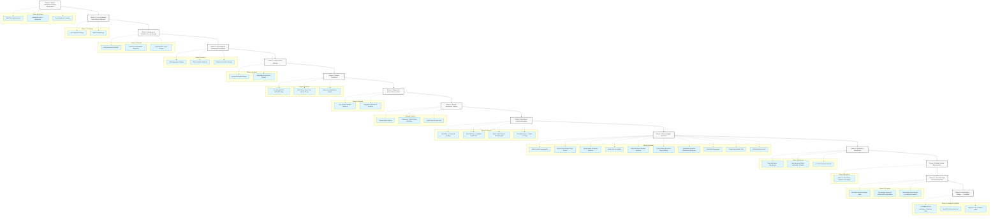

# Feature Roadmap: Keystroke Dynamics Integration

This roadmap outlines the strategic phases for integrating passive behavioral tracking and sensor analytics into the custom keyboard project. The focus is on securely capturing device interactions and transforming them into meaningful, actionable insights for the user.

> **Status at a glance (2026-05-17):** Phases 1 → 10, 12, 13 are **implemented and on `main`**, along with every sub-phase (8.1 – 8.5, 9.1 – 9.18) and two post-Phase-8 error-rate corrections. The dashboard is a five-tab `ViewPager2` (Summary · Trends · Daily Activity · Keystroke Dynamics · Habits). The app is rebranded to **MoodScript** on-device. `IkdDatabase.version = 3`. The single remaining planned phase is **Phase 14 — gamification badges**. Quick status table: [`STATUS.md`](STATUS.md); narrative report: [`../PROJECT_JOURNEY.md`](../PROJECT_JOURNEY.md).

## Visual Roadmap Overview


```mermaid
flowchart TD
    classDef phase fill:#f9f9f9,stroke:#333,stroke-width:2px;
    classDef feature fill:#e1f5fe,stroke:#0288d1,stroke-width:1px;

    P1[Phase 1: Sensor Calibration & Debug Environment]:::phase
    P1_1[Phase 1.1: Live Keyboard Data & Metric Alignment]:::phase
    P2[Phase 2: Background Collection & Local Storage]:::phase
    P3[Phase 3: User Insights & Dashboard Presentation]:::phase
    P4[Phase 4: Session Detail Refresh]:::phase
    P5[Phase 5: Session Dashboard]:::phase
    P6[Phase 6: Diagnostics Screen Improvements]:::phase
    P7[Phase 7: Emoji & Autocorrect Capture]:::phase
    P8[Phase 8: Mood Bar & Contextual Overlay]:::phase
    P9[Phase 9: Global Insights Expansion]:::phase
    P10[Phase 10: Rebrand to MoodScript]:::phase
    P12[Phase 12: Mood-Curated Emoji Section]:::phase
    P13[Phase 13: Persistent Right-Anchored Mood Bar]:::phase
    P14[Phase 14: Gamification — Badges  ·  PLANNED]:::phase

    P1 --> P1_1
    P1_1 --> P2
    P2 --> P3
    P3 --> P4
    P4 --> P5
    P5 --> P6
    P6 --> P7
    P7 --> P8
    P8 --> P9
    P9 --> P10
    P10 --> P12
    P12 --> P13
    P13 --> P14

    subgraph Phase 1 Features
        F1[Real-Time Data Interface]:::feature
        F2[Kinematic Sensor Integration]:::feature
        F3[Touch Dynamics Tracking]:::feature
    end

    subgraph Phase 1.1 Features
        F1_1[Live Keyboard Capture]:::feature
        F1_2[Metric Realignment]:::feature
    end

    subgraph Phase 2 Features
        F4[Lifecycle-Aware Activation]:::feature
        F5[Privacy-First Metadata Extraction]:::feature
        F6[Asynchronous Local Storage]:::feature
    end

    subgraph Phase 3 Features
        F7[Data Aggregation Engine]:::feature
        F8[Visual Analytics Modules]:::feature
        F9[Subjective Context Overlay]:::feature
    end

    subgraph Phase 4 Features
        F10[Session Metadata Header]:::feature
        F11[Magnitude-First Sensor Display]:::feature
    end

    subgraph Phase 5 Features
        F12[Per-Session KPI + Metadata Strip]:::feature
        F13[IKD / Gyro / Accel Time-Series Charts]:::feature
        F14[Raw Lists Replaced by Charts]:::feature
    end

    P1 -.-> F1 & F2 & F3
    P1_1 -.-> F1_1 & F1_2
    P2 -.-> F4 & F5 & F6
    P3 -.-> F7 & F8 & F9
    P4 -.-> F10 & F11
    subgraph Phase 6 Features
        F15[Live Session Insights Shortcut]:::feature
        F16[Diagnostics Screen UI Refresh]:::feature
    end

    subgraph Phase 7 Features
        F17[Emoji Palette Capture]:::feature
        F18[Autocorrect / Spell-Check Detection]:::feature
        F19[WPM Formula Correction]:::feature
    end

    subgraph Phase 8 Features
        F20[Mood Bar on Keyboard Toolbar]:::feature
        F21[Mood Overlay on Session Dashboard]:::feature
        F22[Mood Trend Chart on Global Insights]:::feature
        F22a[Mood-Bar Dance + Haptic on Select]:::feature
    end

    subgraph Phase 9 Features
        F23[Mood Section Formalisation]:::feature
        F24[Gyro & Accel Global Trend Charts]:::feature
        F25[Typing Habits & Session Statistics]:::feature
        F25b[Mood Filter on Insights]:::feature
        F25c[Daily Activity & Calendar Heatmap]:::feature
        F25d[Hourly Activity & Time-of-Day Heatmap]:::feature
        F25e[Keystroke Dynamics Distribution Histograms]:::feature
        F25f[Orientation Breakdown]:::feature
        F25g[Usage Map Bubble Chart]:::feature
        F25h[Activity Quality Scatter]:::feature
    end

    subgraph Phase 10 Features
        F26[New App Name: MoodScript]:::feature
        F27[New Launcher Glyph: keyboard + 3 hearts]:::feature
        F28[Local AboutActivity override]:::feature
    end

    subgraph Phase 12 Features
        F29[Mood-Curated Emoji Section in the drawer]:::feature
    end

    subgraph Phase 13 Features
        F30[Mood bar moved to trailing edge]:::feature
        F31[Bar overlays keyboard toolbar AND emoji drawer]:::feature
        F32[Mid-drawer mood change re-curates the section]:::feature
    end

    subgraph Phase 14 Features  PLANNED
        F33[~13 Badges: mood cataloging + keyboard usage]:::feature
        F34[New 6th Achievements tab]:::feature
        F35[Migration 3 to 4: badges table]:::feature
    end

    P5 -.-> F12 & F13 & F14
    P6 -.-> F15 & F16
    P7 -.-> F17 & F18 & F19
    P8 -.-> F20 & F21 & F22 & F22a
    P9 -.-> F23 & F24 & F25 & F25b & F25c & F25d & F25e & F25f & F25g & F25h
    P10 -.-> F26 & F27 & F28
    P12 -.-> F29
    P13 -.-> F30 & F31 & F32
    P14 -.-> F33 & F34 & F35
```

---

## Phase 1: Sensor Calibration and Debug Environment
**Status: Complete (2026-05-01)**

**Objective:** Establish a controlled, isolated testing environment within the companion application to verify that all device sensors are capturing data accurately and at the appropriate frequencies before deploying to the live keyboard.

*   **Real-Time Data Interface:** 
    *   Develop a dedicated diagnostic screen where developers and testers can input text and observe live sensor metrics.
*   **Kinematic Sensor Integration:** 
    *   Connect the device’s internal gyroscope and accelerometer. 
    *   Visualize the X, Y, and Z axes in real-time to observe the physical force and device posture changes during typing.
*   **Touch Dynamics Tracking:** 
    *   Implement logic to precisely measure micro-interactions.
    *   Calculate **Dwell Time** (duration a key is depressed) and **Flight Time** (the transition speed between keys).
*   **Data Validation Export:** 
    *   Provide an option to export short diagnostic sessions to a raw text or spreadsheet format to verify data structure and timing accuracy.

---

## Phase 1.1: Live Keyboard Data Validation & Metric Alignment
**Status: Complete (2026-05-01)**

**Objective:** Correct measurement mismatches from Phase 1 and upgrade data capture to the *actual* keyboard interface. Implement the updated metric standards, setting up accurate behavioral signals for the backend.

Detailed scope: [`Phase1/Phase1.1_Plan.md`](Phase1/Phase1.1_Plan.md)

*   **Typing Speed Analysis:** 
    *   Measure true processing speed through the statistical distribution of flight times, revealing various mental states (cognitive fatigue/depression vs. alertness/anxiety).
*   **Flight Time:** 
    *   Calculate the interval between key release and next key press (UP to DOWN). High ranges characterize hesitation, cognitive overload, or distraction, while short ranges suggest urgency or impulsivity.
*   **Inter-Key Delay (IKD):** 
    *   Track the legacy interval between consecutive key releases (UP to UP) to maintain historical comparison and additional rhythm signatures.
*   **Error Rates Tracking:** 
    *   Calculate the frequency of corrections and typos. Monitor for deviations indicative of cognitive stress or severe depression.
*   **Key Hold Time (Dwell Time):** 
    *   Repurpose "Dwell Time" into Key Hold Time (duration a key is pressed) to assess motor function and potential cognitive slowing vs inattention/restlessness.
*   **Contextual Accelerometer & Gyroscope Data:** 
    *   Incorporate smartphone-specific accelerometer data handling to provide background on physical context (walking, standing, vehicle) simultaneously with keystrokes.

---

## Phase 2: Unobtrusive Background Collection & Secure Local Storage
**Status: Complete (2026-05-01)**

Detailed scope: [`Phase2/Phase2_Plan.md`](Phase2/Phase2_Plan.md)

**Objective:** Seamlessly transition the sensor tracking into the live keyboard environment, ensuring data is collected passively without draining the device battery, causing input lag, or compromising user privacy.

*   **Lifecycle-Aware Activation:** 
    *   Configure the sensors to wake up strictly when the keyboard is summoned on-screen and to power down immediately when the keyboard is hidden.
*   **Privacy-First Metadata Extraction:** 
    *   Hook into the keystroke events to capture timing and physical interaction metrics.
    *   Enforce strict privacy filters: log event types (e.g., "Alphanumeric", "Backspace", "Space") and timestamps while permanently discarding the actual linguistic characters inputted.
*   **Asynchronous Local Storage:** 
    *   Establish a secure, on-device local database to store the collected sensor events.
    *   Ensure data processing and saving occur in the background, keeping the user's typing experience fluid and uninterrupted.

---

## Phase 3: User Insights and Dashboard Presentation
**Status: Complete (2026-05-03)**

Detailed scope: [`Phase3/Phase3_Plan.md`](Phase3/Phase3_Plan.md) · step breakdown: [`Phase3/Phase3_Steps.md`](Phase3/Phase3_Steps.md)

**Objective:** Utilize the companion application to translate vast amounts of raw behavioral and kinematic data into digestible, visual insights that empower the user to understand their digital habits and cognitive states.

The shipped Phase 3 deliberately scoped down to the minimum useful dashboard: three line charts (WPM, average IKD, error rate) over Week / Month / All Time, plus a four-number KPI strip. Cognitive Fatigue Heatmap, Circadian Usage Patterns, and the Subjective Context Overlay listed below were deferred to keep scope tight; they remain candidate features for a future phase.

*   **Data Aggregation Engine:**
    *   Create internal processes to summarize the raw data points into daily and weekly averages (e.g., average words per minute, daily backspace frequency, average dwell times). **(Shipped — `helpers/IkdAggregator.kt`, single SQL `GROUP BY` per chart, ≤ ~52 rows per range.)**
*   **Visual Analytics Modules:**
    *   **Typing Rhythm Trends:** A visual graph displaying typing speed and fluidity over time, helping to establish a user baseline and highlight deviations. **(Shipped — three line charts in `DashboardActivity`.)**
    *   **Cognitive Fatigue Heatmap:** Visual representations of error rates and auto-correct reliance to indicate potential moments of low focus or fatigue. **(Deferred.)**
    *   **Circadian Usage Patterns:** Time-of-day visualizations that map when typing sessions occur, specifically flagging late-night usage that may indicate sleep disruption. **(Deferred.)**
*   **Subjective Context Overlay (Optional):**
    *   Implement a simple daily check-in allowing users to log their mood or energy levels.
    *   Overlay this subjective self-reporting onto the objective sensor graphs to help users identify personal behavioral patterns. **(Deferred — needs schema migration for a `mood_entries` table.)**

---

## Phase 4: Session Detail Refresh — Magnitude-First Sensors + Rich Session Metadata
**Status: Implemented**

Detailed scope: [`Phase4/Phase4_Plan.md`](Phase4/Phase4_Plan.md)

**Objective:** Make the per-session detail screen actually useful at a glance — surface the metadata already captured in `sessions` (orientation, locale, started/ended, counts) alongside derived per-session metrics (WPM, error rate, avg IKD / dwell / flight), and replace the per-axis sensor wall-of-numbers with a magnitude-by-default view that can toggle back to X / Y / Z.

Like Phase 3, Phase 4 is a read-side refresh: zero edits to the keyboard / capture layer, no schema migration, no new dependencies.

*   **Session Metadata Header:** **(Shipped — `event_feed_session_header` LinearLayout in `activity_event_feed.xml`, populated from `IkdSessionStatsLoader.load(sessionId)`.)**
    *   New header card on the session detail screen (`EventFeedActivity` when launched with a session ID) showing started / ended / duration, orientation, locale, event and sensor counts, plus the four derived metrics (WPM, error rate, avg IKD, avg dwell, avg flight).
    *   Powered by one additive `IkdEventDao.getSessionStats(sessionId)` query — averages and counts in a single SQL round-trip — joined in Kotlin with the existing `SessionRecord` row.
*   **Magnitude-First Sensor Display:** **(Shipped — toolbar action in both `EventFeedActivity` and `DiagnosticsActivity`, default mode `MAGNITUDE`.)**
    *   Sensor list rows and Diagnostics live bars default to a single magnitude value (`sqrt(x² + y² + z²)`) instead of three per-axis values.
    *   A single toolbar action toggles between `MAGNITUDE` and `AXES` modes; the choice persists via a new `Config.sensorDisplayMode` preference.
    *   Magnitude is derived in Kotlin at read time — never stored in the DB and never added to the CSV export, so the experiment's data contract stays frozen.

> **Phase 4 follow-up identified during review:** the metadata header turned out to be a 12-row label/value strip *above* unchanged raw timing + sensor lists. The raw rows still dominate the screen and the strip didn't read like a "dashboard." The fix is scoped as Phase 5 below.

---

## Phase 5: Session Dashboard — Charts Replace Raw Lists
**Status: Implemented**

Detailed scope: [`Phase5/Phase5_Plan.md`](Phase5/Phase5_Plan.md)

**Objective:** Turn the saved-session detail screen into a real per-session dashboard, parallel to the aggregate `DashboardActivity` from Phase 3 but scoped to a single session. Drop the raw timing/sensor row dump in favour of a compact KPI strip + metadata chip + three line charts (IKD over time, gyro magnitude over time, accelerometer magnitude over time). Live mode (`EventFeedActivity` without `EXTRA_SESSION_ID`, used as the Diagnostics event log) is preserved as-is.

Like Phases 3 and 4, Phase 5 is a read-side refresh: zero edits to the keyboard / capture layer, no schema migration, **no new dependencies** — the same Phase 3 MPAndroidChart wrapper (`views/IkdLineChartView.kt`) is reused verbatim so the per-session and aggregate dashboards belong to the same visual family.

*   **Per-Session KPI + Metadata Strip:**
    *   Compact 4-cell KPI card at the top of the session detail (Events · Total typing time · WPM · Error rate), styled identically to `DashboardActivity`'s strip
    *   Secondary chip row beneath with avg IKD / avg dwell / avg flight
    *   Single-line metadata chip (Started at · Duration · Orientation · Locale) — sentinel/empty values omitted from the line rather than rendered as "—"
    *   The existing Phase 4 `IkdSessionStatsLoader` (frozen) supplies all four KPI values
*   **IKD / Gyro / Accel Time-Series Charts:**
    *   Three `IkdLineChartView` instances stacked below the KPI strip
    *   Two new additive `@Query` methods (`IkdEventDao.getSessionTimingBuckets`, `SensorSampleDao.getSessionSensorBuckets`) do **SQL-side downsampling** — each chart receives at most 200 points regardless of session length
    *   Bucket width chosen as `max(50 ms, ceil(durationMs / 200))`; SQLite has no `sqrt`, so the loader averages the squared norm in SQL and applies `sqrt` in Kotlin per row (≤ 400 calls per session load)
*   **Raw Lists Replaced by Charts:**
    *   Saved-session mode: the wall of timing rows + sensor sample rows is **removed**. Raw data still exists in `ikd.db` and is still recoverable via the existing per-session CSV export.
    *   Live mode (Diagnostics → "View Log") **keeps** the raw lists — that screen is a real-time debug feed and a different feature.
    *   Phase 4's `Config.sensorDisplayMode` toggle still works in live mode and `DiagnosticsActivity`; on the session dashboard the toolbar action is hidden because there are no rows to toggle.

---

## Phase 6: Diagnostics Screen Improvements
**Status: Implemented (reworked).** Initial implementation in commit `797e8239` shipped the structural changes (status chip, two metric cards, collapsible sensor card, Session Insights toolbar action, additive `SessionDao.getMostRecentSession()`). The rework on `feat/phase6-rework` (see [`Phase6/Phase6_Plan.md`](Phase6/Phase6_Plan.md)) finishes the polish: theme-aware status-chip palette in `res/values{,-night}/colors.xml`, every `MaterialCardView` tinted via `setCardBackgroundColor(getProperBackgroundColor())`, both metric cards using a 3-cell KPI grid that mirrors the Phase 5 session dashboard, persisted sensor-card collapse state, animated chevron, and dimen-referenced paddings.

Detailed scope: [`Phase6/Phase6_Plan.md`](Phase6/Phase6_Plan.md)

**Objective:** Upgrade `DiagnosticsActivity` from a raw-data debug panel into a polished developer screen, and add a one-tap shortcut that surfaces the current (or most recent) keyboard session as a full chart dashboard. This phase is read-side only: zero edits to the keyboard / capture layer, no schema migration, and no new dependencies — all session data already exists in `ikd.db`.
Make it similar in style to the session insights.

*   **Live Session Insights Shortcut:**
    *   A dedicated **"Session Insights"** action is added to the `DiagnosticsActivity` toolbar (icon: the same chart/insights vector used in the overflow menu).
    *   When a session is **currently active** (keyboard open, privacy mode off), tapping the action opens `EventFeedActivity` in live mode — the existing real-time event-log view, exactly as the current "View Log" row already does. The "View Log" row remains for discoverability; the toolbar action is an additional shortcut.
    *   When **no session is active** (keyboard closed or privacy mode on), tapping the action queries `SessionDao.getMostRecentSession()` — a single `SELECT … ORDER BY started_at DESC LIMIT 1` — and opens `EventFeedActivity` in DB-backed mode for that session, landing directly on the session chart dashboard introduced in Phase 5. If the database is empty a snack bar message is shown: *"No sessions recorded yet — start typing to capture your first session."*
    *   `LiveCaptureSessionStore` already exposes whether a session is active; the `DiagnosticsActivity` status-polling handler (runs every 250 ms) already reads this. No new state mechanism is required.
    *   `SessionDao` gains one additive `@Query` method `getMostRecentSession(): SessionRecord?`. Read-only; no existing query is touched.

*   **Diagnostics Screen UI Refresh:**
    *   Metric cards (IKD, Dwell, Flight, Events, Speed, Error Rate) are regrouped into two `MaterialCardView` rows (timing metrics / count metrics) instead of a single flat list, improving scannability.
    *   The **Status** indicator is promoted to a coloured status chip (`active` = green, `idle` = grey, `privacy-on` = amber) above the metric cards rather than buried inline.
    *   Gyro and accel sensor bars are moved into a collapsible **"Sensor Readings"** `MaterialCardView` that is expanded by default but can be collapsed to focus on the typing metrics.
    *   The **"View Log"** row at the bottom is relabelled **"View Event Log"** for clarity now that the toolbar action handles the "quick jump to last session" use case.
    *   Typography and spacing are harmonised with the Phase 5 session dashboard cards (`card_corner_radius = 12 dp`, `card_elevation = 2 dp` from `dimens.xml`).
    *   All layout changes are confined to `res/layout/activity_diagnostics.xml` and `DiagnosticsActivity.kt`; no change to any other activity, helper, or data class.

*   **Rework Polish (Phase 6 rework on `feat/phase6-rework`):**
    *   **Theme-aware status chip** — three hardcoded `Color.parseColor("#…")` literals replaced with per-state colour resources in `res/values/colors.xml` (light) and `res/values-night/colors.xml` (dark). The base `bg_status_chip.xml` drawable now uses `?attr/colorControlNormal` so a chip without a runtime tint still renders something theme-appropriate. Per-state foreground colour means the amber "Privacy On" state now uses black text (white failed AA contrast).
    *   **Card backgrounds tinted** — `applyThemeColors()` mirrors Phase 5's `EventFeedActivity.applyThemeColors()` and calls `setCardBackgroundColor(getProperBackgroundColor())` on the timing card, count card, sensor card, and the new view-log card so they no longer render as unthemed `?attr/colorSurface` slabs on dark themes.
    *   **Count metrics card** gains a "Count Metrics" section label tinted with `getProperPrimaryColor()`, matching the timing card.
    *   **View Event Log row** is wrapped in a `MaterialCardView` matching the metric cards' silhouette.
    *   **KPI-style metric grid** — both metric cards switch from "label : value" rows to a 3-cell horizontal KPI grid (big bold value, small label) identical to Phase 5's session-dashboard KPI strip.
    *   **Persisted sensor-card collapse** — `Config.diagnosticsSensorCardExpanded` (default `true`) survives navigation away from the screen.
    *   **Animated chevron** — 150 ms rotation animation instead of an instantaneous flip.
    *   **Inline `12dp` / `4dp` paddings** replaced with `@dimen/normal_margin` and `@dimen/small_margin`.

---

## Phase 7: Emoji & Autocorrect Capture
**Status: Implemented**

Detailed scope: [`Phase7/Phase7_Plan.md`](Phase7/Phase7_Plan.md)

**Objective:** Close two capture blind-spots that have existed since Phase 1.1 — emoji palette insertions (which bypass `onKey` entirely) and external text replacements triggered by the system spell-check service (which are invisible to the IME except via `onUpdateSelection`). This is the first phase since Phase 2 to deliberately reopen the keyboard layer; every edit is additive and scoped to instrumentation only.

*   **Emoji Palette Capture:**
    *   Add `fun onEmojiText(text: String)` to `OnKeyboardActionListener` (default delegates to `onText` — backward-compatible).
    *   `MyKeyboardView`'s emoji adapter callback routes through `onEmojiText` instead of `onText`; clipboard taps remain uncaptured.
    *   `SimpleKeyboardIME` overrides `onEmojiText` to record an `EMOJI` event with normal IKD / hold / flight timing before committing the text. Emoji events count toward WPM.
*   **Autocorrect / Spell-Check Detection:**
    *   `SimpleKeyboardIME.onUpdateSelection` is instrumented with an "expected cursor/text" tracker. When an external actor (system spell-check accept, VN Telex inline replacement) moves the cursor unexpectedly, the IME emits an `AUTOCORRECT` event with `is_correction = true`.
    *   `AUTOCORRECT` events automatically fold into the existing error-rate metric with no aggregator or schema change required.
    *   The `AUTOCORRECT` category is forward-compatible with any future autocorrect mechanism added to the IME.
*   **WPM Formula Correction:**
    *   `IkdAggregator` and `IkdSessionStatsLoader` WPM queries are updated to exclude `AUTOCORRECT` events from the keystroke denominator (corrections are not new typing). Error rate is unchanged — it continues to derive from `is_correction`.
    *   New JVM unit tests cover the adjusted WPM formula.

> **No schema migration.** `event_category` is already a `TEXT` column; new values land in the existing column. `IkdDatabase.version` stays at 1.

---

## Phase 7.1: AUTOCORRECT Replacement Weight
**Status: Implemented**

Detailed scope: [`Phase7.1/Phase7.1_Plan.md`](Phase7.1/Phase7.1_Plan.md)

**Objective:** Capture the **replaced character count** for every `AUTOCORRECT` event so a single autocorrect of a long misspelled word (the user's `ocasdasda` → `october` test case) contributes 9 units of error to the metric instead of 1 — fixing the surprising 9.1% reading and aligning the error-rate denominator with WPM's keystroke-only denominator from Phase 7.

*   **New `correction_weight INTEGER NOT NULL DEFAULT 0` column on `ikd_events`** with a strictly-additive `Migration(2, 3)` that backfills weight 1 onto every existing `is_correction = 1` row so dashboards over historical data are continuous across the upgrade. (Phase 8 had already shipped its own `Migration(1, 2)` for `mood_entries` by the time Phase 7.1 landed, so the schema bump is 2 → 3, not the original 1 → 2 the plan describes.)
*   **Capture wiring:** `recordAutocorrectEvent(replacedLength)` carries the new field; `BACKSPACE` rows always set weight 1; the `AUTOCORRECT` heuristic in `maybeRecordExternalReplacement` passes `(oldSelEnd - oldSelStart).coerceAtLeast(1)`.
*   **New error-rate formula** in both `IkdAggregator` and `IkdSessionStatsLoader`: `100 * SUM(correction_weight) / keystrokeCount` (was `100 * COUNT(is_correction) / eventCount`). Sessions without autocorrects are byte-identical between the two formulas.
*   **CSV** gains a trailing `correction_weight` column on the timing block; strictly additive, parsers reading the original seven columns ignore the eighth.
*   **Live diagnostics** (`DiagnosticsActivity.updateComputedMetrics`) mirrors the same formula on the in-memory event list, with a defensive `effectiveWeight()` fallback for events captured just before the migration.
*   **Folded in:** the Phase 7 follow-up fix for the autocorrect false-positive when the IME commits onto a user-selected range (`pendingOurSelectionReplacement` flag in `SimpleKeyboardIME`). Same heuristic, more accurate.

> **Follow-up fix (commit `569f331b`, post-Phase-8.3):** the Phase 7.1 weighted-error-rate formula had two bugs surfaced by on-device testing.
> 1. The denominator `keystrokeCount` only excluded `AUTOCORRECT` rows, leaving `BACKSPACE` rows in the denominator. Typing `hello world` (11 chars) and backspacing all 11 read 11/22 = **50 %** instead of the user-expected 100 %. Fixed by switching to *productive keystrokes* — `eventCount - correctionCount` — which excludes both `AUTOCORRECT` and `BACKSPACE`. New `correctionCount` projection on `EventBucketRow`; the `SessionStatsRow` projection was already there.
> 2. `BACKSPACE` rows always carried `correction_weight = 1`, even when one keypress deleted an N-char selection or word-grapheme. Fixed by reading the selection length (or `getCountToDelete()` for grapheme deletes) before recording the timing event — new `SimpleKeyboardIME.computeBackspaceWeight()` helper.
>
> Net effect: `ocasdasda<space>`+autocorrect stays at 90 %; legacy backfill drifts 18.18 % → 20 %; `hello world<BS×11>` now reads 100 %; selecting all and pressing BACKSPACE once also reads 100 % (BACKSPACE-on-selection symmetry with AUTOCORRECT's replaced-span weight). Manual test plan: [`roadmap/ErrorRateFix_TestPlan.md`](ErrorRateFix_TestPlan.md).

---

## Error-Rate Follow-up: Drop AUTOCORRECT from the formula entirely
**Status: Implemented** (commit `303e792f`, post-Phase-8.3)

Detailed scope: [`roadmap/ErrorRateFix_DropAutocorrect_Plan.md`](ErrorRateFix_DropAutocorrect_Plan.md)

On-device testing showed the autocorrect detector still mis-fires across OEMs — the user's `ocasdasda → october` case sometimes produces no AUTOCORRECT row at all (0 % reading), and spell-check underlining of in-progress text can fire a phantom AUTOCORRECT row (inflating the reading). Per the user directive ("let's just remove autocorrect from the error rate formula"), the metric layer's definition of "correction" is now **BACKSPACE only**:

```
errorRatePct = 100 * SUM(correction_weight WHERE category = 'BACKSPACE') / (keystrokeCount - backspaceCount)
```

where `keystrokeCount = COUNT(*) - COUNT(AUTOCORRECT)`. AUTOCORRECT rows are still captured (CSV, per-session event log) but no longer contribute to either numerator or denominator. Sessions without autocorrects are byte-identical to the Phase-7.1 formula; Test 3 of `ErrorRateFix_TestPlan.md` is the only behaviour change (it now reads `0.0 %`). DAO projections renamed `correctionCount`/`correctionWeight` → `backspaceCount`/`backspaceWeight`; `IkdAggregator`, `IkdSessionStatsLoader`, and `DiagnosticsActivity.updateComputedMetrics` updated; new JVM fixtures added. **Known follow-up:** the Habits-tab error metric (Phase 9.3) and the Daily-Quality scatter (Phase 9.10) still treat AUTOCORRECT as a correction — separate optional cleanup.

> **No schema bump.** The `correction_weight` column stays; readers just project a different slice out of it.

---

## Phase 8: Mood Bar & Contextual Overlay
**Status: Implemented (incl. 8.1 UI polish — see [`Phase8/Phase8_Plan.md`](Phase8/Phase8_Plan.md#12-post-merge-ui-polish-phase-81))**

Detailed scope: [`Phase8/Phase8_Plan.md`](Phase8/Phase8_Plan.md)

**Objective:** Let the user annotate their current emotional state with a single tap during a typing session. That one-tap signal becomes a first-class dimension in both per-session and global dashboards, realising the "Subjective Context Overlay" deferred at the end of Phase 3.

*   **Seven-button Emotion Bar on the Keyboard Toolbar (replaces the Phase 2 standalone privacy shield):**
    *   A horizontal strip of seven buttons appears in the keyboard top bar — `🛡️ 😊 😲 🤢 😢 😨 😠`. The leftmost shield slot subsumes the Phase 2 privacy-toggle button verbatim; the next six are Ekman's six basic emotions [Ekman 1972, 1992] ordered best-to-worst by valence.
    *   The buttons are mutually exclusive — at most one is highlighted. With privacy on the shield is highlighted; with privacy off and no tap yet, no slot is highlighted (Decision #7).
    *   Tapping any of the six emotion buttons disables privacy mode and writes/replaces a `MoodEntry` (sessionId, timestamp, moodScore 1–6) keyed on the active session.
    *   Tapping 🛡️ enables privacy mode, finalises any in-flight session via the existing `LiveCaptureSessionStore.stopSession()` path (Phase 2 semantics preserved), and deletes any mood row for that session.
    *   **No auto-write** — sessions without an explicit emotion tap have no `MoodEntry` row (Decision #10). This sidesteps the Neutral / no-rating problem entirely (Decision #11).
    *   `IkdSettingsActivity` gains a "Privacy mode on by default" row backed by the existing `Config.privacyModeEnabled` flag (Decision #25 — no new pref key). The keyboard 🛡️ button and the settings row are two affordances over the same flag.
    *   *(Phase 8.1 polish)* `IkdSettingsActivity` also gains a "Show mood bar in keyboard" toggle backed by the new `Config.showMoodBar` flag (default true). When disabled, the keyboard's seven-button bar is hidden entirely; privacy stays reachable from the settings row above.
    *   Privacy invariant: `MoodEntry` stores only the integer ordinal valence (1–6) and a timestamp — no text, no emoji codepoint. Score → emoji mapping lives in the UI layer only (`helpers/MoodEmoji.kt`).

*   **Mood Overlay on Session Dashboard (`EventFeedActivity`):**
    *   When a session has a `MoodEntry`, the KPI strip grows from four cells to five (emoji + label).
    *   Sessions without a mood entry keep the original four-cell layout — the fifth cell collapses cleanly.
    *   *(Phase 8.1 polish)* The originally planned standalone "Mood: 😊 Happiness" line under the metadata was removed — it duplicated the KPI cell. The fifth KPI cell is now the single mood surface on this screen.

*   **Mood widgets on Global Insights (`DashboardActivity`):**
    *   A fourth chart card "Mood over Time" — line chart with Y axis 1 (Happiness) → 6 (Anger), bucketed identically to the existing three charts. Null buckets render as line breaks.
    *   A "Mood Distribution" panel below the chart cards — six rows in display order (Happiness → Anger), each emoji + label + horizontal progress bar + count.
    *   A fifth KPI cell "Avg Mood" showing the rounded emoji + the precise number (e.g. `🤢 3.2`).
    *   All three are gated on `total > 0` for the selected range; otherwise hidden, and the KPI strip falls back to four cells.
    *   New `IkdMoodAggregator` (Phase 3 read surface stays frozen); new `MoodDao` with `getMoodBuckets` + `getMoodDistribution` queries.

*   **CSV export gains a third dual-block segment:** `#mood_entries\nsession_id,timestamp_ms,mood_score`. Strictly additive — parsers reading only the first two blocks remain backwards-compatible.

> **Schema change required.** Phase 8 bumps `IkdDatabase.version` to 2 and adds the `mood_entries` table via `Migration(1, 2)`. The migration is non-destructive: it only adds a new table and leaves all existing tables untouched. The migration test in `app/src/androidTest` covers v1-data preservation, the unique index on `session_id`, and SQLite's NULL-distinctness behaviour for sessionless rows.

---

## Phase 8.2: Mood Bar UX Polish (Toggles, Capsule, Chat-Bubble)
**Status: Implemented**

Detailed scope: [`Phase8/Phase8_Plan.md` § 13](Phase8/Phase8_Plan.md#13-mood-bar-ux-polish-phase-82)

**Objective:** A second on-device review pass after Phase 8.1 surfaced three more issues with the mood bar — slots that were "click-to-set, but no way to unset"; a transient toast for the only feedback channel; and a bar that visually read as seven floating glyphs rather than one keyboard control. Phase 8.2 makes the bar feel like a first-class keyboard widget without changing what's stored.

*   **Slots are now true toggles:**
    *   Tapping the highlighted 🛡️ now disables privacy without committing to a mood (closing the gap where the only way out of privacy was picking an emoji).
    *   Tapping a highlighted emotion deletes the `MoodEntry` row without re-enabling privacy.
    *   Two new controller methods mirror the existing `enablePrivacyAndClearMood` path: `IkdMoodBarController.disablePrivacy` (flips `Config.privacyModeEnabled` without touching the mood row) and `clearMoodForActiveSession` (deletes the row without touching privacy). Deselect paths are silent — the highlight change *is* the feedback.
*   **Stretched-key capsule background:**
    *   The horizontal bar is centred in the toolbar and dressed as one rounded "stretched key" capsule, themed at runtime via `mKeyColor` / `mStrokeColor` so it tracks the active keyboard theme.
    *   The clipboard chip / inline suggestions / clear / voice buttons are hidden while the bar is on; the pinned-clipboard and settings buttons stay anchored on the right edge.
    *   Selected glyph rendered at `scaleX/scaleY 1.25` (rendering only — tap area unchanged) so the active emotion lifts above the row. Dimmed alpha tightened from 0.6 → 0.45 to strengthen the selected-vs-unselected hierarchy. `clipChildren=false` on the toolbar holder + mood bar so the scaled glyph isn't cropped.
*   **Chat-bubble feedback popup:**
    *   `PopupWindow` anchored above the tapped slot replaces the generic `Toast` calls with first-person feedback ("I'm feeling happy", "I want privacy", …).
    *   Auto-dismisses after 1500 ms; consecutive taps reset the timer and reuse the same popup so there's no flicker.
    *   New `Config.showMoodPopup` (default `true`) plus a settings row in `IkdSettingsActivity` lets users silence the bubble without disabling the underlying state change. Strictly additive new flag; `Config.showMoodBar` from Phase 8.1 is unchanged.

> **No schema change.** `IkdDatabase.version` stays at 2. Capture path frozen — the only Kotlin code that runs in this phase lives on the keyboard view + settings layer.

---

## Phase 8.3: Mood Distribution over Time (Stacked Bar) on Insights
**Status: Implemented**

Detailed scope: [`Phase8/Phase8.3_Plan.md`](Phase8/Phase8.3_Plan.md)

**Objective:** Drop the Phase 8 "Avg Mood" KPI cell and "Mood over Time" line chart from `DashboardActivity`, and replace them with a per-bucket **stacked-bar chart** showing the percentage breakdown of each Ekman category in each time bucket. Averaging an ordinal valence across six categorical labels produces numbers that don't correspond to any user-reportable state — `🤢 3.2` ("around Disgust, slightly toward Sadness") is technically valid but interpretively vague, and the line chart inherits the same problem at every bucket. The stacked bar chart preserves the time dimension *without* re-introducing a meaningless average. Reverses Phase 8 Decision #14 and lifts the deferred "Stacked-bar-by-day chart" out of Phase 8 §10.

*   **Remove avg-based mood widgets:** `dashboard_kpi_avg_mood_cell` and `dashboard_mood_chart_card` are deleted from `activity_dashboard.xml`; the matching strings (`dashboard_kpi_avg_mood_label`, `dashboard_avg_mood_value_format`, `dashboard_chart_mood_title`, `dashboard_chart_mood_y_label`) are removed from `strings.xml`. KPI strip falls back to four cells.
*   **Add Mood Mix over Time stacked bar chart:** new `views/IkdStackedBarChartView.kt` wraps MPAndroidChart's `BarChart` in stacked mode, mirroring the Phase 3 `IkdLineChartView` discipline. Each bar is one time bucket; each segment is one of the six Ekman categories; bars sum to 100%. X axis aligns with the existing IKD charts (same `Range.bucketFormat`). Custom legend below the chart with emoji + colour swatch + label.
*   **Mood Distribution panel kept verbatim:** counts-per-category for the whole range remains useful — and complementary to the time-distributed stacked chart.
*   **One additive DAO query:** `MoodDao.getMoodCategoryBuckets(bucketFormat, fromMs, toMs)` returning `List<MoodCategoryBucketRow>`; ≤ 30 buckets × 6 categories = 180 rows worst case for Month range. Pure-Kotlin `IkdMoodAggregator.Companion.buildMixSnapshot(...)` for unit testing, parallel to the existing `buildSnapshot`.
*   **No schema change.** `IkdDatabase.version` stays at 2. The capture path stays fully frozen. CSV format unchanged.

---

## Phase 8.4: Mood-Bar Dance + Haptic on Slot Select
**Status: Implemented** (commit `7e8895ab`)

Detailed scope: [`Phase8/Phase8.4_Plan.md`](Phase8/Phase8.4_Plan.md). Pointer summary in [`Phase8_Plan.md` § 14](Phase8/Phase8_Plan.md#14-mood-bar-dance--haptic-on-slot-select-phase-84).

**Depends on:** Phase 8 (mood bar exists), Phase 8.1 (`clipChildren="false"` on `mood_bar`), Phase 8.2 (selected-glyph scaling at `1.25×`, `vibrateIfNeeded()` already wired into every slot click handler).

**Objective:** Make picking a mood feel rewarding. When the user **selects** a slot on the keyboard's seven-button mood bar (privacy 🛡️ or one of the six emotions), the tapped emoji plays a short pop + wiggle animation while the existing keyboard haptic fires. Deselect taps stay silent — preserves Phase 8.2's "highlight change is the feedback" rule for deselect.

*   **Three-phase animation envelope (~360 ms total):** pop the slot from `1.25×` to `1.6×` over 120 ms (eased), wiggle for 220 ms via parallel rotation (`±12°` keyframes) and horizontal jitter (`±3 dp` keyframes), settle back to `1.25×` over 20 ms (eased). Mirrors the existing clipboard show/hide `AnimatorSet` precedent at `MyKeyboardView.kt:1324–1351`.
*   **Reuses existing haptic:** `vibrateIfNeeded()` already runs on every mood-slot click handler (`MyKeyboardView.kt:633` + `:652`), gated on `Config.vibrateOnKeypress`. **No new vibration code, no new pref keys.**
*   **Cancellation-safe:** rapid double-taps and slot switches resolve cleanly via `currentMoodDanceAnimator?.cancel()` + an explicit on-end cleanup that snaps the view to its settled scale, rotation `0`, translationX `0`.
*   **Single-file change:** `views/MyKeyboardView.kt` only — one private helper, one companion-object constant (`MOOD_BAR_SCALE_DANCE_PEAK = 1.6f`), one nullable animator field, two single-line wires inside `onMoodSlotClicked`. Net diff ~35 LOC. **No XML edits** — `clipChildren="false"` was already set in Phase 8.2. **No new strings, dimens, prefs, schema migration, or capture-layer reopen.**

> **Privacy invariants preserved.** The animation is a pure UI transform on the tapped `TextView`; it observes no captured data, writes nothing, and cannot influence what's stored.

---

## Phase 8.5: Collapsible Mood Bar with Persistent Standing Rating + Inactivity Reset
**Status: Implemented** (commit `8e322b33`)

Detailed scope: [`Phase8/Phase8.5_Plan.md`](Phase8/Phase8.5_Plan.md). Pointer summary in [`Phase8_Plan.md` § 15](Phase8/Phase8_Plan.md#15-collapsible-mood-bar-with-persistent-standing-rating--inactivity-reset-phase-85).

**Depends on:** Phase 8 (mood bar exists, `mood_entries` table), Phase 8.1 (`Config.showMoodBar` toggle), Phase 8.2 (capsule background, chat-bubble, toggle semantics, `IkdMoodBarController.{disablePrivacy,clearMoodForActiveSession}`). Compose-safe with Phase 8.4 in either landing order (8.5 Decision #11).

**Objective:** Reshape the seven-button mood bar from a centered always-expanded toolbar widget into a **left-anchored, collapsible chip** that remembers the user's last selected mood across sessions and auto-expires that standing rating after one hour of inactivity. Resolves three friction points from the Phase 8 / 8.1 / 8.2 baseline: (a) per-session mood storage means users re-tap their self-rating every keyboard reopen and stop bothering, (b) the always-expanded bar hides clipboard chip / suggestions / voice while it's on, (c) stale ratings linger until manually cleared, diluting the analytical signal.

*   **Display-only standing rating.** New `Config.lastMoodScore: Int` (default `MoodEmoji.SCORE_NONE = 0`) remembers the user's last selected mood across sessions, but only **pre-highlights the chip** — it never auto-writes to `mood_entries`. The Phase 8 invariant "a `mood_entries` row = the user actively annotated this session" is preserved unchanged. A user who reopens the keyboard, sees their persisted 😊 in the chip, and taps it once in the expanded bar gets a row written for the new session — same as today.
*   **Three-zone collapsible layout** (one container, deterministic widths so `suggestions_holder` doesn't jitter): collapsed indicator `TextView` + expanded slots `LinearLayout` + chevron `ImageView`. The mood bar moves from centered to leading-edge (`start=parent`, `end=startOf(suggestions_holder)`). `clipboard_clear` stays inflated, hidden via `applyMoodBarVisibility()` (no behaviour change vs Phase 8.2). When `Config.showMoodBar == false`, a runtime `ConstraintSet` re-anchors `suggestions_holder.start = endOf(clipboard_clear)` and restores `clipboard_clear`.
*   **Empty collapsed glyph:** grayed neutral placeholder (`🙂` at alpha 0.45). Distinct from the shield (privacy ON) and from any of the six emotions. The shield was rejected as ambiguous when `Config.privacyModeEnabled == false`.
*   **Inactivity reset (1 hour):** new `Config.lastMoodActivityTimestamp: Long` updated on **mood selection** + on `SimpleKeyboardIME.onFinishInputView` (best-effort backstop). **Not updated per-keystroke** to avoid `SharedPreferences.edit().commit()` on the IME thread (CLAUDE.md "Critical Constraint"). On-show staleness check fires from both `SimpleKeyboardIME.onStartInputView` (primary) and `MyKeyboardView.refreshMoodBarFromState` (secondary, covers long-attached IME edge case). Reset action: clear `Config.lastMoodScore` only — **does not flip `Config.privacyModeEnabled`** (per user choice "respect Config.privacyModeEnabled default").
*   **Subtle animations** matching Phase 8.2 / Phase 6 polish (150–200 ms, no overshoot). Switches `applyMoodBarHighlight` from instant transforms to `view.animate().cancel(); view.animate()…` chains with cancel-before-restart. New `applyMoodBarLayout(expanded, animate)` mirrors `DiagnosticsActivity.applySensorExpansion` — chevron rotation + cross-fade between collapsed indicator and expanded slots. Auto-collapses after every slot tap so the user sees their selection echoed in the chip without a second chevron tap.
*   **Reopened files:** `views/MyKeyboardView.kt` (biggest delta), `res/layout/keyboard_view_keyboard.xml`, `helpers/Constants.kt`, `helpers/Config.kt`, `helpers/MoodEmoji.kt` (`SCORE_NONE` sentinel + `isStandingScore()` helper), `helpers/IkdMoodBarController.kt` (Config writes alongside DAO writes — three method bodies grow; **no new method, no new threading**), `services/SimpleKeyboardIME.kt` (two narrow lifecycle wires), `res/values/strings.xml`. **No schema migration, no DAO changes, no aggregator changes, no capture-path semantic change.** `IkdDatabase.version` stays at 3.

> **Privacy invariants preserved.** `Config.lastMoodScore` is one `Int` in `SharedPreferences`. No new DB rows, no new exported data, no new sensor reads. The Phase 8 third dual-block CSV segment (`#mood_entries`) is unchanged. The 1-hour reset is local-only and clears `Config.lastMoodScore` to `SCORE_NONE`; it does not clear `mood_entries` rows already written (those remain in the DB until the parent session is deleted via Phase 2 retention).

---

## Phase 9: Global Insights Expansion
**Status: Implemented** — 10 sub-phase commits `f2d13b33` … `38ae0d63` landed on `main` (no feature branch — user override). 32 new JVM tests pass; lint clean; detekt +4 issues (LargeClass + TooManyFunctions on `DashboardActivity` / DAOs and ComplexCondition on heatmap/bubble views — scope-acceptable).

**Depends on:** Phase 8 (mood entries in `ikd.db`), Phase 8.1 polish (current dashboard surface), Phase 8.2 (mood bar UX), Phase 8.3 (mood-mix stacked-bar shape)

**Absorbs:** the deferred Phase 11 ("Usage Map & Daily Activity Charts") — every Phase 11 chart was lifted into a Phase 9 sub-phase. Phase 11 is deleted from the roadmap (Phase 9 plan Decision #16).

Detailed scope:

- [`Phase9/Phase9_Plan.md`](Phase9/Phase9_Plan.md) — orchestrator (implementation order, dependency graph, frozen surfaces, cross-cutting decisions).
- [`Phase9/sub_plans/`](Phase9/sub_plans/) — 10 self-contained sub-plan files, one per sub-phase. Implementer agents load only the orchestrator + their assigned sub-plan to optimise context.

**Objective:** Expand `DashboardActivity` from a single page of three IKD line charts + a four-cell KPI strip into a multi-section, multi-card global insights hub modelled after the [BiAffect research dashboard](https://www.biaffect.com/8203biaffect-meets-the-world/tracking-mental-health-through-keystroke-dynamics-with-biaffect). Ten sub-phases on a single read-side-only branch — no schema migration (`IkdDatabase.version` stays at 3), no keyboard-layer reopen, no new Gradle dependency. Five labelled dashboard sections after Phase 9 lands: **Trends → Daily Activity → Mood → Keystroke Dynamics → Habits**.

*   **9.1 Mood Section formalisation:**
    *   Wrap the existing Phase 8.3 stacked-bar mood-mix card and Phase 8 Mood Distribution panel in a labelled **Mood** section with its own primary-coloured section header, parallel to the new **Habits** section header that 9.3 introduces.
    *   Add a sibling **Trends** section header above the existing IKD chart group so the dashboard reads as four labelled sections (KPI · Trends · Mood · Habits) rather than nine sibling cards.
    *   Pure layout pass — no new charts, no aggregator changes, no DAO changes.

*   **9.2 Gyro & Accel Global Trend Charts:**
    *   Two new aggregate line charts on `DashboardActivity`: **Average Gyro Magnitude over Time** and **Average Accel Magnitude over Time**, bucketed by the same `Range.bucketFormat` as the existing IKD chart so the X axes align.
    *   Mirrors Phase 5's per-session sensor charts but aggregated across sessions: `AVG(x*x + y*y + z*z)` in SQL, `Math.sqrt` per row in Kotlin (same SQLite-has-no-sqrt workaround). Null buckets render as line breaks.
    *   New `helpers/IkdSensorAggregator.kt` (sibling of `IkdAggregator`); new additive `SensorSampleDao.getSensorBuckets(sensorType, bucketFormat, fromMs, toMs, moodScore: Int?)` query. The existing per-session `getSessionSensorBuckets` from Phase 5 is untouched.

*   **9.3 Typing Habits & Session Statistics:**
    *   A new **Habits** section beneath Mood with four trend line charts and a four-cell Habits KPI strip:
        *   **Average Session Duration over Time** (minutes per session, daily/weekly bucketed).
        *   **Sessions per Day / Week** — typing frequency over time, makes gaps in usage visible.
        *   **Average Error Rate over Time** — daily/weekly weighted error rate (matches the Phase 7.1 formula `100 * SUM(correction_weight) / keystrokeCount`).
        *   **Average Flight Time over Time** — trend of the mean flight-time per day/week, proxy for hesitation and cognitive load.
    *   Habits KPI strip: total sessions, total typing time, average session duration, longest streak (consecutive days/weeks with at least one session, computed in Kotlin from the existing aggregation output — no extra SQL).
    *   New `helpers/IkdHabitsAggregator.kt` (sibling of `IkdAggregator`); one additive `IkdEventDao.getHabitsBuckets(...)` query that joins event-side and session-side aggregations on the bucket key in a single round-trip. Pure `Companion.computeLongestStreak(buckets)` for unit testing.

*   **9.4 Mood Filter on Insights:**
    *   Horizontally scrollable single-select chip row above the range selector — `All` + the six emoji (😊 😲 🤢 😢 😨 😠). Default `All` (current behaviour); the chip row is `View.GONE` until the user records their first `MoodEntry`.
    *   Selecting a non-`All` chip re-runs every aggregator on the same `Dispatchers.IO` hop and re-renders every chart and every KPI scoped to *sessions whose `session_id` has a `mood_entries` row with `mood_score = X`*. Lets the user ask the new behavioural question: "*what does my typing look like when I'm angry vs happy?*"
    *   Tapping the active emoji chip toggles back to `All` (mirrors Phase 8.2's mood-bar slot toggles). Filter state is persisted in `onSaveInstanceState`, **not** in `SharedPreferences` — per-screen-instance, not per-user-preference.
    *   New `MoodDao.hasAnyMoodEntry()` query gates chip-row visibility. `IkdAggregator`, `IkdSensorAggregator`, `IkdHabitsAggregator`, and the four new BiAffect-inspired aggregators (9.5 / 9.7 / 9.8 / 9.10) each gain a `moodFilter: Int? = null` parameter on `snapshot(...)`. The mood widgets (Mood Distribution + stacked-bar mood-mix) intentionally render the degenerate one-row / one-colour result under a non-`All` filter — that's the user feedback that the filter is in effect.

*   **9.5 Daily Activity — Calendar Heatmap + Daily Keypress Bar:** *(BiAffect-inspired.)*
    *   GitHub-contributions-style calendar heatmap (rows = ISO week-of-year, columns = day-of-week, cell intensity = total keystrokes). Tap a cell → toast with date + count.
    *   Per-day bar chart of total keypresses across the selected range. Mirrors the BiAffect3 v3.0.2 "Daily keypresses graph" called out in release notes.
    *   New `helpers/IkdActivityAggregator.kt` (one aggregator covers 9.5, 9.6, 9.9 — the queries share the `(day, hour)` shape). New `views/IkdHeatmapView.kt` custom theme-aware `View` (used in 9.5 and 9.6).

*   **9.6 Hourly Activity — 24-Hour Bar + Hour × Weekday Heatmap:** *(BiAffect-inspired.)*
    *   24-bar bar chart (one bar per hour-of-day, range-scoped) showing keystrokes accumulated in each hour across the selected range.
    *   24×7 hour × weekday heatmap rendered using the same `IkdHeatmapView`. **Always all-time** (Decision #18) — single-week data is too sparse to expose a circadian pattern; the chart card subtitle ("Across all your sessions") documents the static range scope to the user.
    *   Lifts the **Time-of-Day Heatmap** from the deleted Phase 11 spec.

*   **9.7 Keystroke Dynamics Distribution — IKD / Dwell / Flight Histograms:** *(BiAffect-inspired.)*
    *   Three histograms surfacing the *distribution shape* of inter-key delay, hold-time, and flight-time over the selected range. Log-scale X axis (`10–20 ms`, `20–40 ms`, …, `5120–10240 ms`); count on Y.
    *   Outliers above the top bucket are clipped into it with a small "+ outliers" annotation.
    *   New `helpers/IkdDistributionAggregator.kt`; three additive `@Query` methods on `IkdEventDao`. Bucket edges are a hardcoded log-scale `LongArray` shared across the three queries.

*   **9.8 Orientation Breakdown:**
    *   Donut (or stacked horizontal bar) showing the share of typing sessions by phone orientation across the selected range. Surfaces `SessionRecord.orientation` for the first time since Phase 2 stored it.
    *   Combined with the 9.4 Mood Filter, answers questions like "*do I type lying down more when I'm sad?*"
    *   Sentinel `-1` ("Not captured" — orientation capture disabled in settings) shown only when ≥ 1 session in the range has that value.

*   **9.9 Usage Map (Bubble Chart):** *(Lifted from Phase 11.)*
    *   Time-vs-date bubble chart — Y axis = calendar date, X axis = hour of day in 1-hour columns, bubble area = keystroke count. Tooltip on tap (date / hour / count / locale).
    *   Bubble radius scales linearly between 1 dp and 12 dp. When more than one locale exists in the range, bubbles are coloured by locale.
    *   New `views/IkdBubbleMapView.kt` custom `View` with per-bubble hit-test for the tooltip. Reuses the `IkdActivityAggregator` `(day, hour)` payload — zero new queries beyond 9.6.

*   **9.10 Activity Quality Scatter:** *(Lifted from Phase 11.)*
    *   X = backspaces for the day, Y = autocorrection count, one bubble per day. Most-recent day rendered larger and at full alpha; older days fade to 20% alpha.
    *   Subtitle preserves the research-led framing: *"When our mind is clear we tend to make fewer typing errors and require less backspace usage. On such days, the most recent data point will be closer to the origin."*
    *   New `helpers/IkdQualityAggregator.kt`; one additive `IkdEventDao.getDailyQuality(...)` query.

> **Privacy invariants preserved.** Phase 9 reads existing tables only — no new captured data, no new pref keys (`Constants.kt` and `Config.kt` stay frozen), no CSV format change. The mood filter joins on the already-stored `mood_entries.session_id` and `mood_entries.mood_score`; nothing is written.

---

## Phase 9.11 → 9.18: Insights navigation & presentation polish
**Status: Implemented** — all on `main`. Sub-plans under [`Phase9/sub_plans/`](Phase9/sub_plans/).

After Phase 9's ten content sub-phases landed, a run of micro-phases reshaped the dashboard's *navigation and presentation* on top of those charts. The dashboard ended up as a five-tab `ViewPager2` with a top `TabLayout`:

*   **9.11 — TODAY range + multi-tab `ViewPager2`** (`eb8454f2`, `f00b5713`). `IkdAggregator.Range` gains `TODAY(days = 1, bucketFormat = "%Y-%m-%d %H")`; `formatBucketLabel` renders hourly buckets as `"HH:00"`. Charts that go degenerate under TODAY (calendar heatmap, daily-keypress bar, Usage Map) hide cleanly; the Habits longest-streak KPI gains a `StreakUnit.HOURS` mode. The five Phase 9 sections move into `Fragment` subclasses under `activities/dashboard/`; `DashboardActivity` shrinks ~1100 → ~340 LOC, dispatching the snapshot payload to the visible fragment.
*   **9.12 — themed tabs, top tab toggle, KPI dedup** (`cc0f64aa`). The vertical `NavigationRailView` is replaced with a top tab toggle; the tab strip is themed; the duplicate global KPI strip is removed.
*   **9.13 — widget info icons** (`7c8da71e`). Every Insights widget gains a tap-to-explain ⓘ icon (`WidgetInfoDialog` / `WidgetInfo` / `strings_widget_info.xml`).
*   **9.14 — Summary tab, TabLayout w/ icons, filter bottom sheet** (`503ba841`, `36062ab4`, `dd6cf9c9`). A new **Summary** tab is inserted at index 0 as the landing page (KPI grid + tile click-through); the tab toggle becomes a `TabLayout` with icons in `MODE_FIXED`; the Range + Mood filters collapse into a toolbar bottom sheet with an active-filter chip below the tabs.
*   **9.15 — Summary rework + drop the Mood tab** (`6b70ad96`). Summary becomes a flat 3×2 KPI grid; the Usage Map and the Mood Mix + Mood Distribution widgets move onto it; the dedicated **Mood tab is deleted** (`MoodFragment` removed). Tab count 6 → 5: **Summary · Trends · Daily Activity · Keystroke Dynamics · Habits**.
*   **9.16 — bucket-size hint + Sessions shortcut + streak fix** (`31348365`, `549282ef`, `3efa6e96`). A bucket-size hint renders below the active-filter chip; a Sessions-history shortcut is added to the overflow menu; the longest-streak metric is fixed to only count calendar-consecutive days.
*   **9.17 — mood-colour refresh, distribution-first Summary, mood-tinted Usage Map** (`4f233a1c`). The six `mood_color_*` tokens are reset to conventional emotional associations (gold = happy, orange = surprise, green = disgust, blue = sad, purple = fear, red = anger; light + dark variants). The Mood Distribution panel moves to the top of the Summary tab as six coloured percentage tiles that double as the screen's colour legend. Each Usage Map bubble is tinted by the dominant mood of the sessions in its `(day, hour)` cell (via a new `MoodEmoji.colorResFor` + a small `MoodDao.getAllSessionMoods` post-pass in `IkdActivityAggregator`).
*   **9.18 — Distribution tiles double as the Mood Filter** (`2462c519`, `fa354a23`, `d8035a3f`, `439f2431`). Tapping a Distribution tile sets the global Mood Filter to that score (every aggregator re-runs via the Phase 9.4 `*ForMood` paths); tapping the active tile (or the active-filter chip ✕) reverts to All. The tiles keep showing the *unfiltered* range distribution so they remain a usable filter-picker and legend; an empty-result filter offers an escape hatch.

> **No schema migration** across 9.11 – 9.18, no keyboard-layer reopen, no new Gradle dependency. `IkdDatabase.version` stays at 3.

---

## Phase 10: Rebrand to MoodScript
**Status: Implemented** (commit `2adaa70d`)

Detailed scope: [`Phase10/Phase10_Plan.md`](Phase10/Phase10_Plan.md) · visual mockup: [`Phase10/Phase10_Identity_Mockup.html`](Phase10/Phase10_Identity_Mockup.html)

**Objective:** Retire the on-device "Fossify Keyboard" identity now that the app has grown into a keystroke-dynamics + mood + insights research platform. **Cosmetic only.**

*   **New app name** — installs as **MoodScript** (`app_launcher_name` becomes `translatable="false"`; locale overrides removed; `redirection_note` brand token swapped inline per locale).
*   **New launcher glyph** — the original Fossify keyboard silhouette (rounded-rect outline + 5×2 dot keys + spacebar pill, white) *cradled by three concentric heart outlines* fading outward (Option F). Only `ic_launcher_foreground.xml` + `ic_launcher_monochrome.xml` change — all 19 Material-700 colour variants and the Settings → Customize Colors → App icon picker keep working unchanged.
*   **New About screen** — local `org.fossify.keyboard.activities.AboutActivity` extending Commons `AboutActivity`, with MoodScript-led intro copy + a small Fossify upstream credit; `AndroidManifest.xml` repointed.
*   **Out of scope (deferred to a future release-readiness pass):** `applicationId` rename (still `org.fossify.keyboard` — a rename triggers a one-time `ikd.db` copy + Play Store re-listing), fastlane / store metadata, `colorPrimary` palette change, `versionName` bump, Kotlin-package / repo-directory renames. `LICENSE` untouched.

> **No schema migration.** `IkdDatabase.version` stays at 3.

---

## Phase 12: Mood-Curated Emoji Section in the Drawer
**Status: Implemented** (commit `bf305176`)

Detailed scope: [`Phase12/Phase12_Plan.md`](Phase12/Phase12_Plan.md)

**Objective:** When the user opens the keyboard's emoji drawer **and a standing mood is set** (`Config.lastMoodScore != SCORE_NONE`), prepend a context-aware section at the top of the emoji list with ~15–25 curated emojis for that mood. When no mood is set, the drawer renders unchanged.

*   `MoodEmoji.curatedEmojisFor(score)` returns the curated codepoints per Ekman category (lead with the face emoji that the mood bar shows, then adjacent face variants, then non-face symbols carrying the same valence). Inline Kotlin constants — never written to disk.
*   `MyKeyboardView`'s emoji-palette assembly prepends an `Item.Category("mood_curated")` + `Item.Emoji` entries; `EmojiHelper.getCategoryTitleRes` resolves a new `Mood: <emoji>` header string.
*   Every curated-section tap flows through the Phase 7 `onEmojiText` pipeline → an `EMOJI` event with **no codepoint stored**. No new capture event type, no new column, no schema bump (`IkdDatabase.version` stays at 3).

> **Phase numbering note.** The deleted Phase 11 slot is *not* reused; this feature is numbered Phase 12.

---

## Phase 13: Persistent Right-Anchored Mood Bar (visible inside the emoji drawer)
**Status: Implemented** (commit `5dd826a5`)

Detailed scope: [`Phase13/Phase13_Plan.md`](Phase13/Phase13_Plan.md)

**Objective:** Make the keyboard's mood bar a first-class persistent UI element so the user can change their mood *without closing the emoji drawer* — which immediately re-curates the Phase 12 section.

*   The `mood_bar` LinearLayout moves out of `toolbar_holder` and becomes a direct child of `keyboard_holder`, declared **after** `emoji_palette_holder` so it draws on top, anchored to the **trailing edge** with `app:elevation="4dp"`. `keyboard_holder` gains `clipChildren="false"` so the Phase 8.4 dance peak and the Phase 8.2 chat bubble aren't cropped.
*   Right-side toolbar icons (`voice_input_button`, `pinned_clipboard_items`, `settings_cog`) shift left to make room; `settings_cog` re-anchors back to the parent edge when `Config.showMoodBar == false` via the existing `ConstraintSet` flip pattern. `voice_input_button` + `pinned_clipboard_items` are hidden while the bar is expanded.
*   Every Phase 8.2 / 8.4 / 8.5 behaviour is preserved verbatim — collapsible chip, dance animation, chat-bubble feedback, standing rating. It's purely a re-position + re-layer.
*   A mid-drawer mood change re-curates the Phase 12 section: `SimpleKeyboardIME.onSharedPreferenceChanged` watches `LAST_MOOD_SCORE` and calls a new public `MyKeyboardView.notifyEmojiAdapterMoodChanged()` (no-op when the drawer isn't open), which re-runs `setupEmojis()` on `Dispatchers.IO`. This routes the rebuild through the existing keyboard-refresh listener channel, guaranteeing it runs *after* the Config write commits.

> **No schema migration**, no new capture-path behaviour, no DAO touch, no new aggregator. `IkdDatabase.version` stays at 3.

---

## ~~Phase 11: Usage Map & Daily Activity Charts~~

**Deleted from the roadmap.** Phase 11's three planned views were absorbed into Phase 9's sub-phases:

- The bubble Usage Map → **Phase 9.9** (`IkdBubbleMapView`).
- The backspaces-vs-autocorrections scatter → **Phase 9.10**.
- The hour × weekday heatmap → **Phase 9.6** (`IkdHeatmapView`).

See Phase 9 above and the Phase 9 orchestrator's Decision #16 for the rationale. The Phase 12 / 13 / 14 numbering picks up after 11 so git archaeology stays unambiguous.

---

## Phase 14: Gamification — Badges (Mood + Keyboard)
**Status: Planned** — the single remaining unimplemented phase

Detailed scope: [`Phase14/Phase14_Plan.md`](Phase14/Phase14_Plan.md)

**Depends on:** Phase 8 (mood entries), Phase 9.15 (current five-tab layout)

**Objective:** Add a starter set of ~13 badges that reward consistent mood cataloging and keyboard usage, surfaced as a new sixth **"Achievements"** tab in the Insights dashboard, with a brief in-app snackbar when a new badge unlocks.

*   **New `badges` table via `Migration(3, 4)`** — `id`, `badge_key` (unique index), `unlocked_at`. `IkdDatabase.version` bumps 3 → 4. New `models/Badge.kt`, `interfaces/BadgeDao.kt`. Migration test extended.
*   **New `helpers/IkdBadgeCatalog.kt`** (static list of 13 `BadgeDef`s — 6 mood-cataloging, 7 keyboard-usage) + `helpers/IkdBadgeEvaluator.kt` (`suspend fun evaluate()` on `Dispatchers.IO`; pure `Companion.evaluateBadges` for unit tests; reads existing tables only).
*   **New `activities/dashboard/AchievementsFragment.kt`** + `adapters/BadgeAdapter.kt` + `item_badge_card.xml` — a 2-column grid of badge cards (locked = greyscale + 0.45 alpha; unlocked = full colour + unlock date). `DashboardPagerAdapter` gains a 6th tab branch.
*   **In-app `Snackbar`** anchored to the dashboard when one or more new badges unlock during a `loadDashboard` evaluation. No system notifications, no notification permission.
*   **Privacy unchanged.** Badges are derived from existing `ikd_events` / `sessions` / `mood_entries`. No new captured data, no new pref keys, no CSV column (no `badges` block in the export).

> **Phase numbering note.** This was originally drafted as "Phase 13"; that slot was claimed by the Persistent Right-Anchored Mood Bar feature (above) before this work started, so the gamification plan is renumbered to **Phase 14**. Technical content unchanged from the original draft.